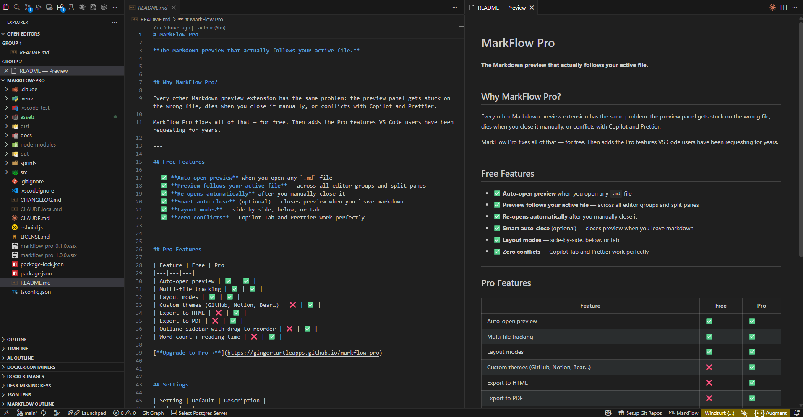
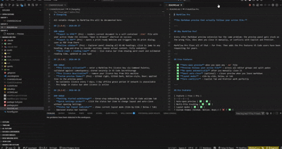

# MarkFlow Pro

**The Markdown preview that actually follows your active file.**

---

## See it in action

---

## Why MarkFlow Pro?

Every other Markdown preview extension has the same problem: the preview panel gets stuck on the wrong file, dies when you close it manually, or conflicts with Copilot and Prettier.

MarkFlow Pro fixes all of that — for free. Then adds the Pro features VS Code users have been requesting for years.

---

## Free Features

- ✅ **Auto-open preview** when you open any `.md` file
- ✅ **Preview follows your active file** — across all editor groups and split panes
- ✅ **Re-opens automatically** after you manually close it
- ✅ **Smart auto-close** (optional) — closes preview when you leave markdown
- ✅ **Layout modes** — side-by-side, below, or tab
- ✅ **Zero conflicts** — Copilot Tab and Prettier work perfectly

---

## Pro Features

| Feature | Free | Pro |
|---|---|---|
| Auto-open preview | ✅ | ✅ |
| Multi-file tracking | ✅ | ✅ |
| Layout modes | ✅ | ✅ |
| Custom themes (GitHub, Notion, Bear…) | ❌ | ✅ |
| Export to HTML | ❌ | ✅ |
| Export to PDF | ❌ | ✅ |
| Outline sidebar with drag-to-reorder | ❌ | ✅ |
| Word count + reading time | ❌ | ✅ |

[**Upgrade to Pro →**](https://gingerturtleapps.github.io/markflow-pro)

---

## Settings

| Setting | Default | Description |
|---|---|---|
| `markflowPro.enabled` | `true` | Enable auto-preview |
| `markflowPro.layout` | `sideBySide` | Layout: `sideBySide`, `below`, `tab` |
| `markflowPro.autoClose` | `false` | Close preview when leaving markdown |
| `markflowPro.pro.theme` | `default` | Preview theme (Pro) — `default`, `github`, `githubDark`, `notion`, `bear` |

---

## Ginger Turtle

Built by [Ginger Turtle](https://gingerturtleapps.github.io) — small tools, done properly.
